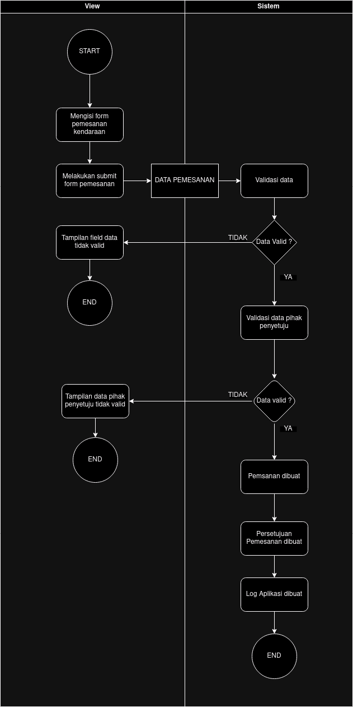

<p align="center"><a href="https://laravel.com" target="_blank"></a></p>

<h2 align="center">Sekawan Media Backend Intern Technical Test</h2>


### 🛠️ TechStacks

[](https://skillicons.dev)
Stack | Tech | Version | 
--- | --- | --- |
🐘 PHP | PHP | 8.3.9
🛢  Database | MariaDB | 5.4 | 
🛠️ Framework | Laravel | 11 |

### ⚙️ System Requirements

#### Physical Data Model


#### Activity Diagram Pemesanan


#### Requirement Fungsional


1. Admin can create new vehicle
2. Admin can update a vehicle
3. Admin can create a reservation for a vehicle with minimum 2 approvers
4. Admin can update a reservation
5. Approver can approve a reservation
6. All users can export reservation data to an excel 


### 🔍 How to Use the Application

NOTE: you need to configure mysql dependancy and enable php gd extension

1. Clone this project
```zsh
git clone https://github.com/devanfer02/sekawan-media-test.git #https

git clone git@github.com:devanfer02/sekawan-media-test.git #ssh
```

2. Change directory to project
```zsh 
cd sekawan-media-test
```

3. Install required dependancies
```zsh
composer install
npm install
```

4. Copy the env file
```zsh
cp .env.example .env
```

5. Generate application key and run the migrations
```zsh
php artisan key:generate
php artisan migrate --seed
```

6. Build tailwindcss in another terminal
```
npm run dev
```

7. Run the application
```
php artisan serve
```

8. Open the application at [http://localhost:8000](http://localhost:8000)

9. Use these login credentials to access the application

Email | Password | Role | 
--- | --- | --- |
admin@gmail.com | pass123 | Admin |
manager@gmail.com | pass123 | Approver | 

