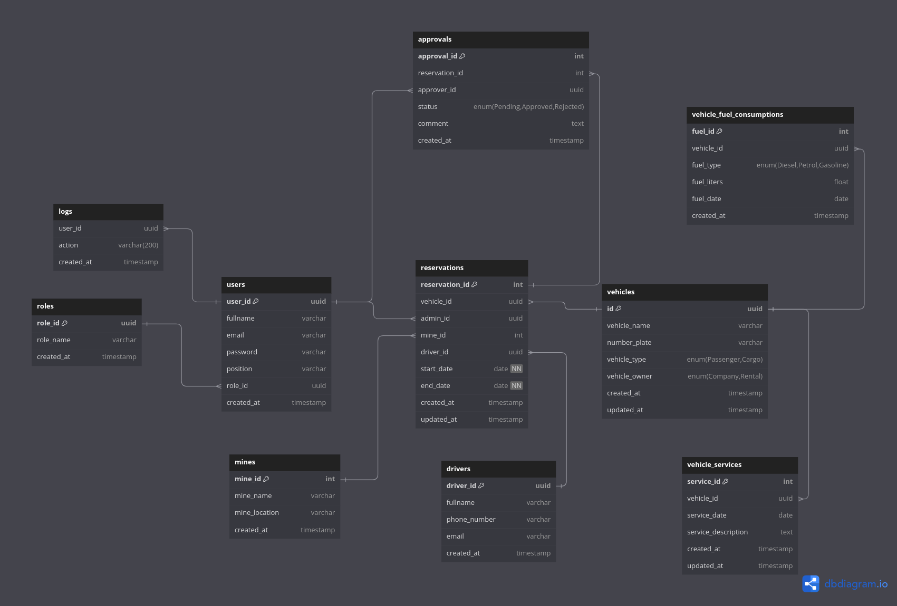

# PT Tambang Media CMS

A web-based management system is designed for PT Tambang Media with operational needs across multiple locations. This system allows the company to monitor and manage company vehicles to track vehicle reservation usage and drivers in real-time, including fuel consumption, service schedules, and vehicle usage history.

## ⚙️ System Requirements

### Physical Data Model


### Activity Diagram Pemesanan


## 🛠️ TechStacks

[](https://skillicons.dev)
Stack | Tech | Version | 
--- | --- | --- |
🐘 PHP | PHP | 8.3.9
🛢  Database | MariaDB | 5.4 | 
🛠️ Framework | Laravel | 11 |

## **User Roles and Features**

### **1. Admin**  
Admins have the highest level of access and can perform the following tasks:

- **Manage Vehicle Reservations**  
  Admins can create new vehicle reservations, assign drivers, and specify approvers for each request. Reservations can also be edited or marked as completed once the usage is finalized.  

- **Add and Manage Vehicles**  
  Admins can register new vehicles into the system, update existing vehicle information, and view detailed records for each vehicle.  

- **Driver Management**  
  Admins can add drivers to the system, edit their details, or remove them if no longer needed.  

- **Monitor Fuel Consumption and Service Records**  
  Admins can log fuel consumption data and schedule or record vehicle services. These records are crucial for tracking operational efficiency.  

- **View Logs and Export Reports**  
  Admins can review detailed logs of system activities and generate periodic reports for reservations in Excel format.  

---

### **2. Approver**  
Approvers are responsible for overseeing reservation requests and ensuring compliance with the company’s policies:

- **Approve or Reject Vehicle Reservations**  
  Approvers can review reservation requests submitted by Admins. Depending on the requirements, they can approve or reject these requests. Approval is done in a multi-level process for better oversight.  

---

### **3. Authenticated User**  
Authenticated users (general users) have access to essential features that provide visibility into the system:

- **Dashboard Access**  
  Users can view a dashboard summarizing vehicle usage, fuel consumption, and overall system activity.  

- **View Reservations and Reports**  
  Users can browse the list of reservations and check the details of any specific reservation. They can also export reports summarizing reservation data.  

- **Monitor Fuel Consumption and Vehicle Services**  
  Users can view fuel consumption logs and service schedules for better insight into vehicle performance.  

- **Monitor Application logs**  
  Users can view history of application activites and changes made by other users


## 🚀 Startup the Application

### 🔨 Development

1. Clone this project
```zsh
git clone https://github.com/dvnf10cpp/tambang-media.git
```

2. Change directory to project
```zsh 
cd tambang-media
```

3. Install required dependancies
```zsh
composer install
npm install
```

4. Copy the env file
```zsh
cp .env.example .env
```

5. Generate application key and run the migrations
```zsh
php artisan key:generate

php artisan migrate --seed

php artisan db:seed --class=DummySeeder # for dummy reservation, approval, vehicle service and vehicle fuel consumption data
```

6. Build tailwindcss in another terminal
```
npm run dev
```

7. Run the application
```
php artisan serve
```

8. Open the application at [```localhost:8000```](http://localhost:8000)

9. Use these login credentials to access the application

<table border="1">
  <thead>
    <tr>
      <th>Fullname</th>
      <th>Email</th>
      <th>Password</th>
      <th>Role</th>
    </tr>
  </thead>
  <tbody>
    <tr>
      <td>Evan Lingga</td>
      <td>evanlingga@gmail.com</td>
      <td>password</td>
      <td>Admin</td>
    </tr>
    <tr>
      <td>Tade Gina</td>
      <td>tadegina@gmail.com</td>
      <td>password</td>
      <td>Approver</td>
    </tr>
    <tr>
      <td>Farrel Deva</td>
      <td>farreldeva@gmail.com</td>
      <td>password</td>
      <td>Approver</td>
    </tr>
    <tr>
      <td>Hikmam Ali</td>
      <td>hikmamali@gmail.com</td>
      <td>password</td>
      <td>Approver</td>
    </tr>
  </tbody>
</table>


### 📦 Deployment

1. Make sure docker is already installed in your machine
2. Clone this project 

```zsh
git clone https://github.com/dvnf10cpp/tambang-media.git

```
3. Change the working directory to the project
```zsh
cd tambang-media
```
4. Copy the env file and set the `DB_HOST` variable to `db` and fill the `DB_PASSWORD` variable
```zsh
cp .env.example .env
```

5. Spin up containers with this command

```zsh
docker compose up -d
```

6. Run the migrations and seeders

```zsh
docker exec -it tambang-app php artisan migrate --seed
docker exec -it tambang-app php artisan db:seed --class=DummySeeder # for dummy reservation, approval, vehicle service and vehicle fuel consumption data
```

. Open your browser and enter [```localhost```](http://localhost)

